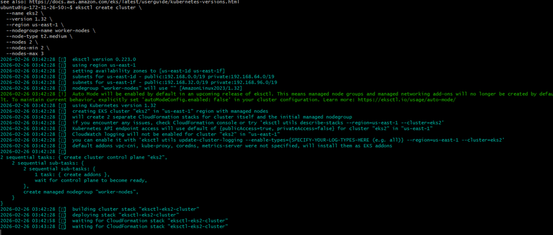
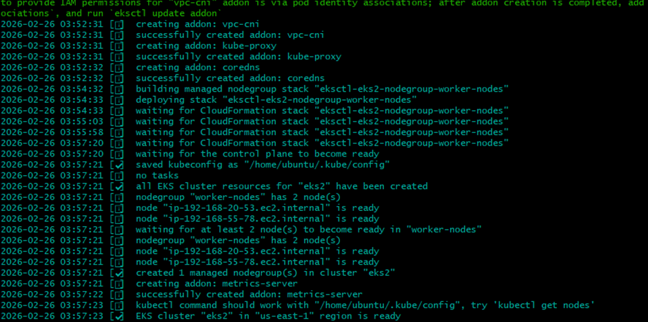
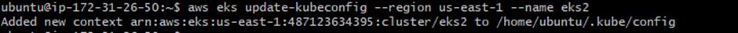

# eksctl create cluster :

eksctl create cluster \
  --name eks2 \
  --version 1.32 \
  --region us-east-1 \
  --nodegroup-name worker-nodes \
  --node-type t2.medium \
  --nodes 2 \
  --nodes-min 2 \
  --nodes-max 3

## AWS creates:

- Control plane

- Worker nodes

- Networking

- IAM roles

But your local machine still does NOT know about it.

### What does aws eks update-kubeconfig do?

- Fetches cluster endpoint from AWS

- Gets cluster certificate

- Configures IAM authentication

- Adds cluster details into ~/.kube/config

- Sets current context to that cluster

## Updating kubeconfig :

> --aws eks update-kubeconfig --region us-east-1 --name eksctl-eks2-cluster

> --aws eks list-clusters --region us-east-1

After this, you can run:

> --kubectl get nodes

##### Without Updating Kubeconfig :

The connection to the server localhost:8080 was refused