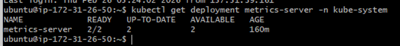

# Metrics Server Troubleshooting

## Issue

kubectl top nodes Error: Metrics API not available

> kubectl get pods -n kube-system

NAME                              READY   STATUS    RESTARTS   AGE
aws-node-t25gl                    2/2     Running   0          79m
aws-node-zk29g                    2/2     Running   0          79m
coredns-6b9575c64c-rvpmg          1/1     Running   0          82m
coredns-6b9575c64c-rzqff          1/1     Running   0          82m
kube-proxy-gtg8q                  1/1     Running   0          79m
kube-proxy-mj8wb                  1/1     Running   0          79m
metrics-server-6556bc968f-29js9   1/1     Running   0          78m
metrics-server-6556bc968f-vmpxp   1/1     Running   0          78m

ubuntu@ip-172-31-26-50:~$ kubectl top nodes
error: Metrics API not available
ubuntu@ip-172-31-26-50:~$

** Metrics Server API not available because APIService is not fully registered and ready

## Root Cause

APIService was not fully registered.Metrics server failed due to TLS verification issue in EKS.

## Fix

Edit deployment and add: --kubelet-insecure-tls

> kubectl edit deployment metrics-server -n kube-system

Argument needed : --kubelet-insecure-tls -> In EKS, metrics-server usually fails because of this
Without it, deployment becomes invalid or pods crash.
Troubleshooting :
kubectl describe deployment metrics-server -n kube-system
kubectl get events -n kube-system
https://d.docs.live.net/ea14a5fd9fc5ec18/Abinaya%20-%202025%20The%20Cloud%20Engineer/Heydevops/Kube/Minitoring%20project/metric%20server%20logs.txt
 
Workaround :
> kubectl edit deployment metrics-server -n kube-system (add this line in components.yaml)
- --kubelet-insecure-tls

## Verification

> kubectl get deployment metrics-server -n kube-system

