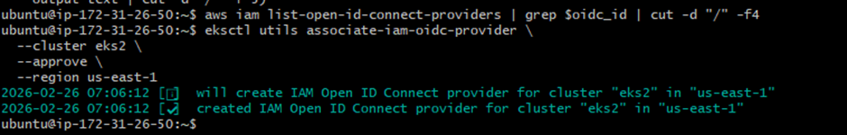
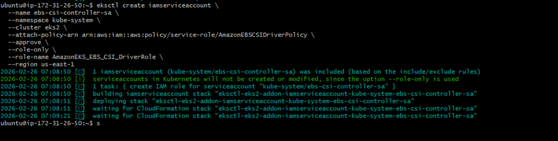
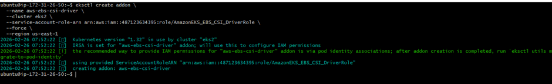
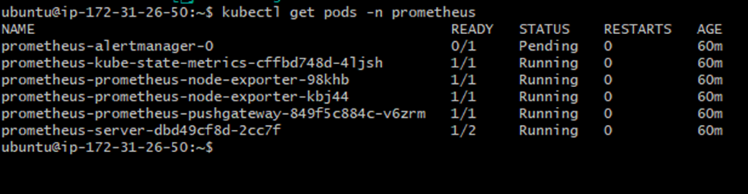

# IRSA Setup (IAM Roles for Service Accounts)

This is very important concept in EKS (IRSA).

## Why IRSA?

Secure way for pods to access AWS services without static credentials.

## Steps

1.  Extract OIDC ID
2.  Associate IAM OIDC provider
3.  Create IAM Service Account
4.  Attach AmazonEBSCSIDriverPolicy
5.  Install EBS CSI Addon

This enables dynamic EBS volume provisioning securely.

#### Step 1

To Create an AWS IAM Role using OIDC (OpenID Connect)
This setup allows Kubernetes pods to securely assume AWS IAM roles without storing AWS credentials inside the container.
- EKS cluster has OIDC issuer URL
- IAM must trust that OIDC provider
- Command checks if provider exists
- If not, it creates and associates it
- Enables IRSA (IAM Roles for Service Accounts)
- Secure way for pods to access AWS resources

> --oidc_id=$(aws eks describe-cluster \
  --name eks2 \
  --region us-east-1 \
  --query "cluster.identity.oidc.issuer" \
  --output text | cut -d '/' -f 5)

aws iam list-open-id-connect-providers | grep $oidc_id | cut -d "/" -f4

- Lists IAM OIDC providers
- Searches for your cluster’s OIDC ID
- If found → already associated
- If nothing prints → not associated

### Not found scenario :

eksctl utils associate-iam-oidc-provider \
  --cluster eks2 \
  --approve \
  --region us-east-1

## CREATE IAM SERVICE ACCOUNT WITH ROLE :

> -- This command is for IRSA setup for EBS CSI Driver
eksctl create iamserviceaccount \
  --name ebs-csi-controller-sa \
  --namespace kube-system \
  --cluster eks2 \
  --attach-policy-arn arn:aws:iam::aws:policy/service-role/AmazonEBSCSIDriverPolicy \
  --approve \
  --role-only \
  --role-name AmazonEKS_EBS_CSI_DriverRole \
  --region us-east-1

**name ebs-csi-controller-sa**
Creates Kubernetes Service Account named: ebs-csi-controller-sa
**namespace kube-system**
Creates it inside: kube-system namespace cluster eks2 Target EKS cluster.

**attach-policy-arn AmazonEBSCSIDriverPolicy**
Attaches AWS managed IAM policy that allows:
•	Create EBS volumes
•	Attach volumes to EC2
•	Delete volumes
--role-name AmazonEKS_EBS_CSI_DriverRole
•	Creates IAM role with this name.

## What Actually happens :
> --role-name AmazonEKS_EBS_CSI_DriverRole

Creates IAM role with this name.
## Creating IAM Role
👉 Attaching EBS policy
👉 Trusting EKS OIDC provider
👉 Preparing role for EBS CSI controller pod
So that:
👉 Kubernetes can dynamically create EBS volumes.
With this,
Pods can request storage
✅ EBS volumes auto-create
✅ Secure IAM via IRSA

> --Attach this role to eks 
eksctl create addon \
  --name aws-ebs-csi-driver \
  --cluster eks2 \
  --service-account-role-arn arn:aws:iam::12345678900:role/AmazonEKS_EBS_CSI_DriverRole \
  --force \
  --region us-east-1

  

> --Kubectl get pods -n Prometheus

