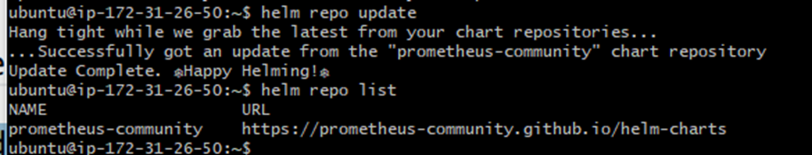
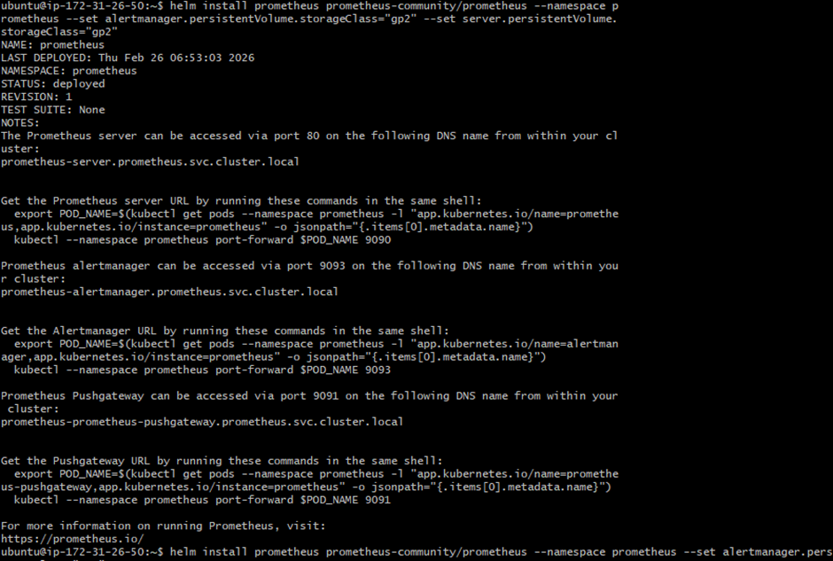
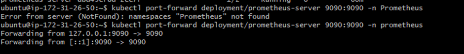

# Prometheus Installation

Now install the Prometheus using the helm chart.
Add Prometheus helm chart repository
helm repo add prometheus-community
https://prometheus-community.github.io/helm-charts

It adds the Prometheus Community Helm chart repository to your local Helm, so you can install charts like prometheus, kube-prometheus-stack, etc., from that repo.

## Update helm chart repository
helm repo update
helm repo list

## Create prometheus namespace
kubectl create namespace prometheus

## Install Prometheus

helm install prometheus prometheus-community/prometheus --namespace
prometheus --set alertmanager.persistentVolume.storageClass="gp2" --set
server.persistentVolume.storageClass="gp2"

kubectl port-forward deployment/prometheus-server 9090:9090 -n prometheus

Forwards port 9090 from the Prometheus pod inside the cluster to your local machine, so you can access it at:
http://localhost:9090

Access using: kubectl port-forward deployment/prometheus-server
9090:9090 -n prometheus

It Works !
