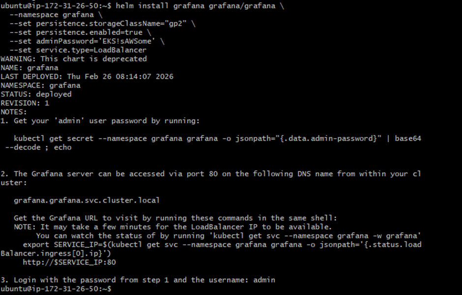
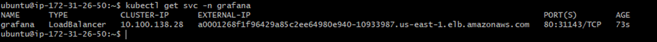
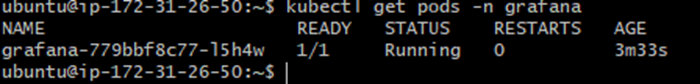
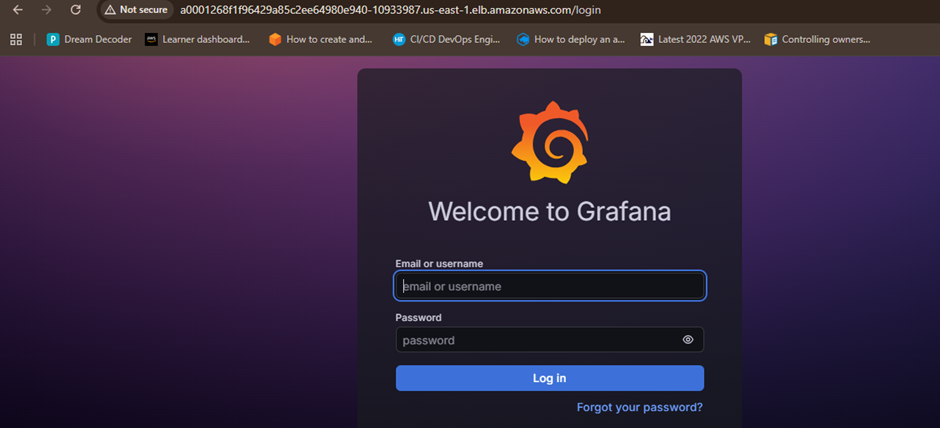
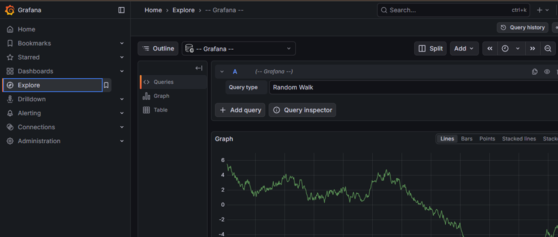
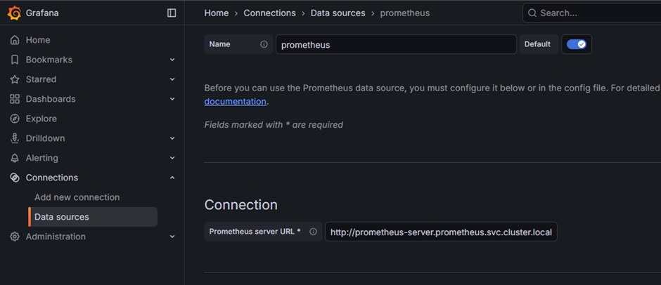
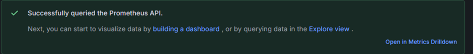
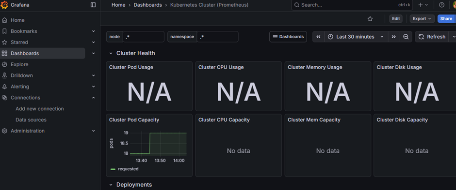

# Grafana Installation

helm repo add grafana https://grafana.github.io/helm-charts helm repo
update

> Create a namespace Grafana : 

kubectl create namespace grafana

This command installs Grafana on EKS with persistent storage and exposes it publicly via an AWS LoadBalancer. 🚀

helm install grafana grafana/grafana --namespace grafana --set
persistence.enabled=true --set persistence.storageClassName="gp2" --set
service.type=LoadBalancer

	helm install grafana grafana/grafana
👉 Installs Grafana Helm chart.
	--namespace grafana
👉 Installs it inside grafana namespace (must exist).
	persistence.enabled=true
👉 Enables storage (data won’t be lost on restart).
	persistence.storageClassName="gp2"
👉 Uses AWS EBS gp2 storage class.
	adminPassword='EKS!sAWSome'
👉 Sets Grafana admin password.
	service.type=LoadBalancer
👉 Creates AWS ELB → gives public external IP.

### After Installation :

kubectl get svc -n Grafana

Default Login: Username: admin Password: EKS!sAWSome

Import Dashboard ID: 6417

Copy the URL and paste on browser :

http://a0001268f1f96429a85c2ee64980e940-10933987.us-east-1.elb.amazonaws.com/login

 Configure the endpoints of Prometheus and save URL - http://prometheus-server.prometheus.svc.cluster.local

 

 

 ### Import the dashboard :

 
